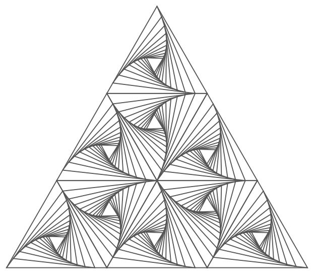
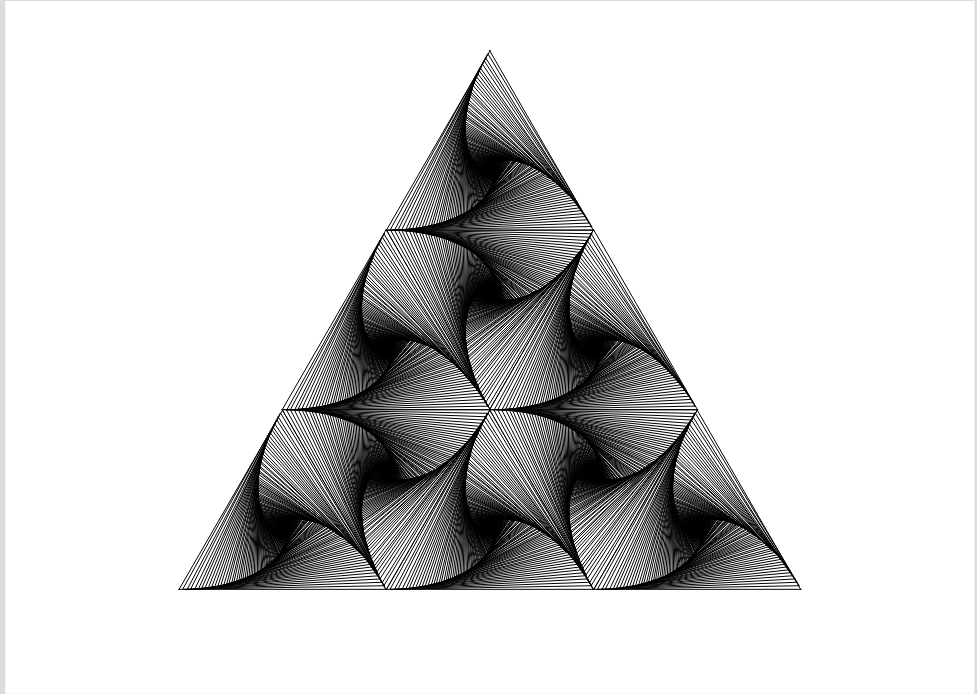

# ParabolicIllusionGA
Project for Computational Geometry involving creating illusion with basic principe of linear interpolation and stacking triangles.

## Inspiration

This project was inspired by classic geometry pattern i found online.

## Realized Project Output

The image below shows the static output of the main geometric figure generated by the GCLC code.

## Animated Result with Colors

The animation below demonstrates the final project, showing the combined effects of the colored spirals.

<video src="ShortColoredVideo.mp4" controls width="800" loop muted></video>